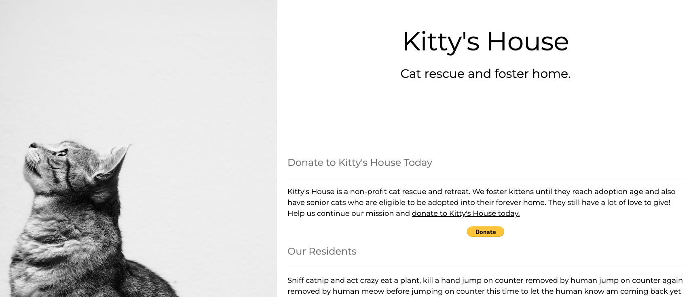
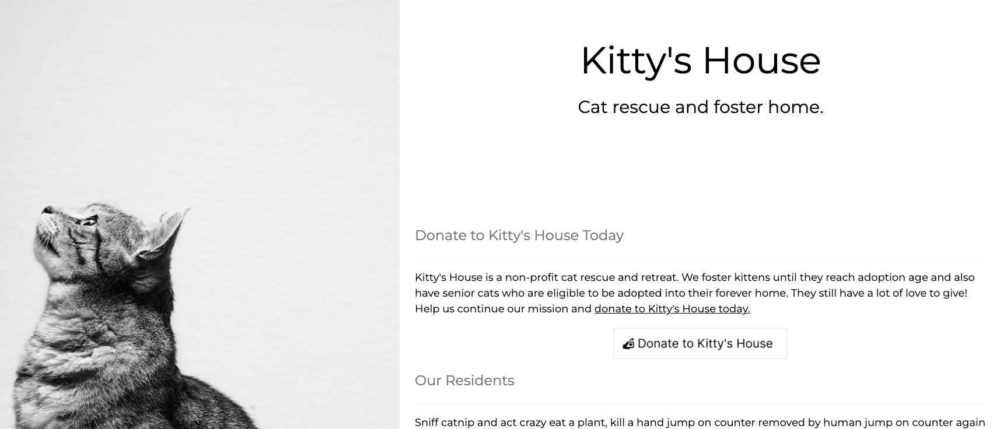
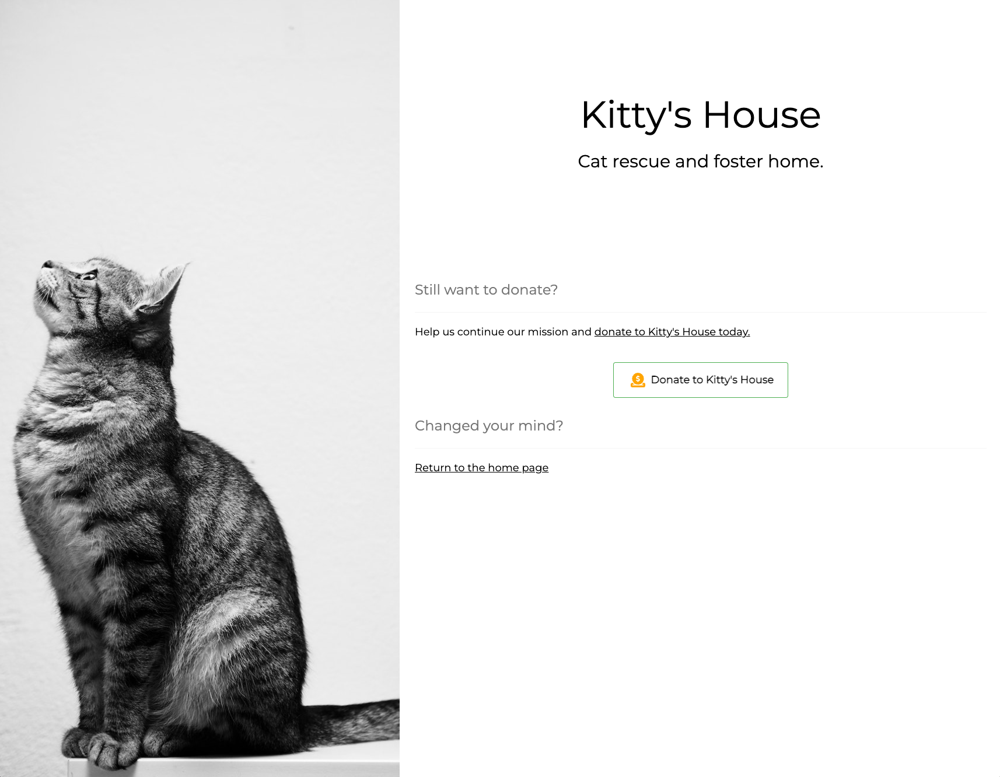
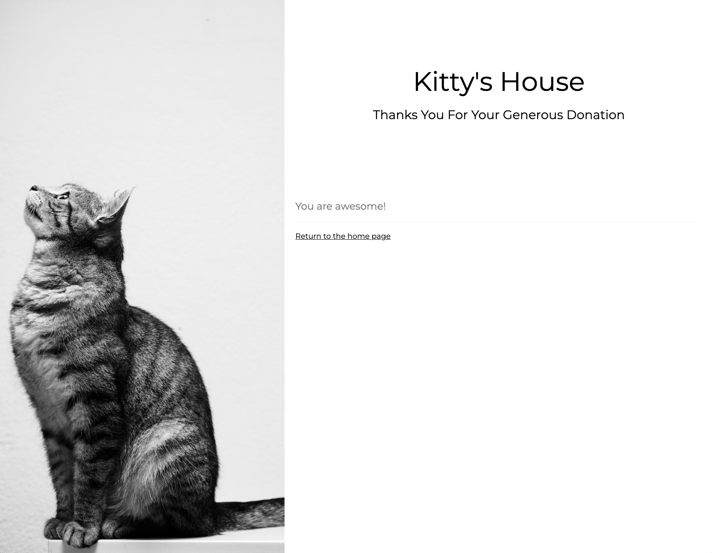

# PayPal Donate Button on a Static Site

Add a donation button to a static website

This demo application shows three ways to add a PayPal donation button to a static website.

See the [PayPal documentation on the Donate SDK](https://developer.paypal.com/sdk/donate/) for setup instructions.

## Example Buttons

[Example button created with CSS](index.html)

[Example PayPal branded hosted button](with-paypal-button.html)

[Example custom hosted button](custom-button.html)

### Have Donors Return to Your Site

Example pages to send a donor back to your website when they cancel or complete their donation.

- [Canceled Donation](cancel.html)
  
- [Completed Donation](completed.html)
- 
